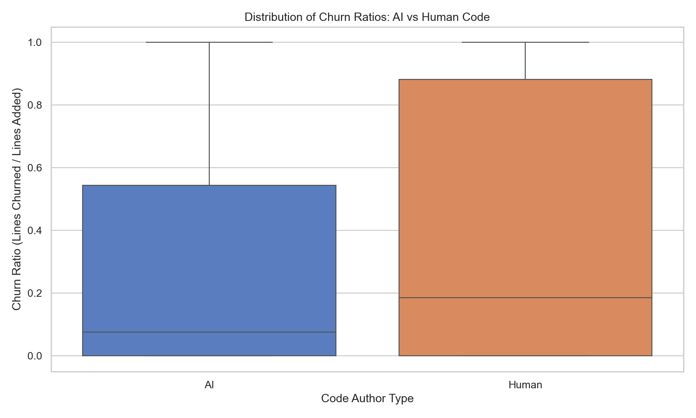
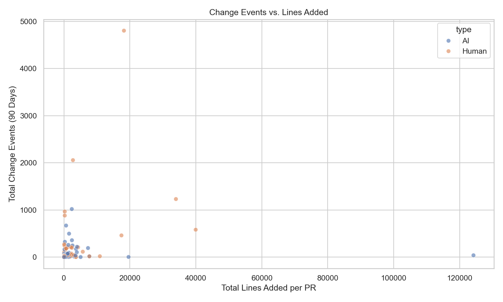
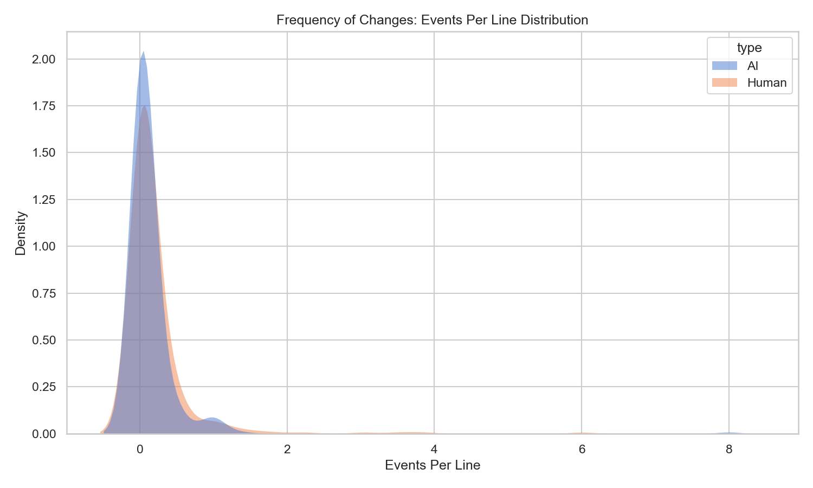
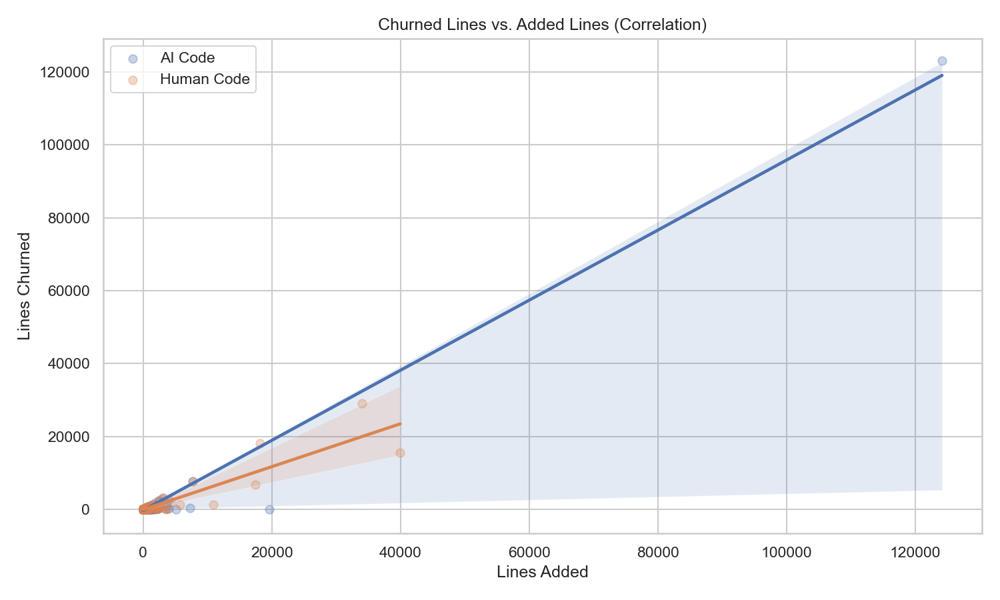
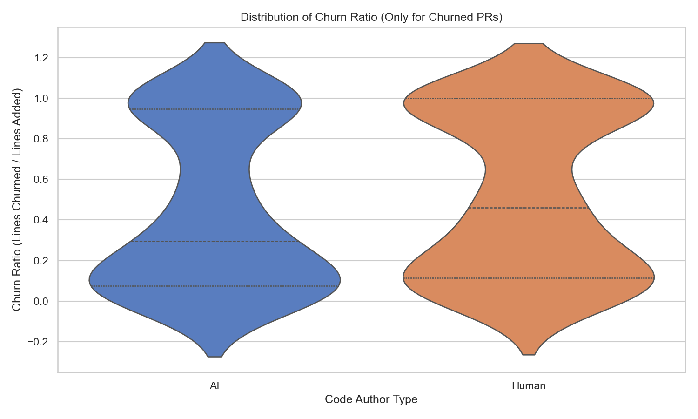
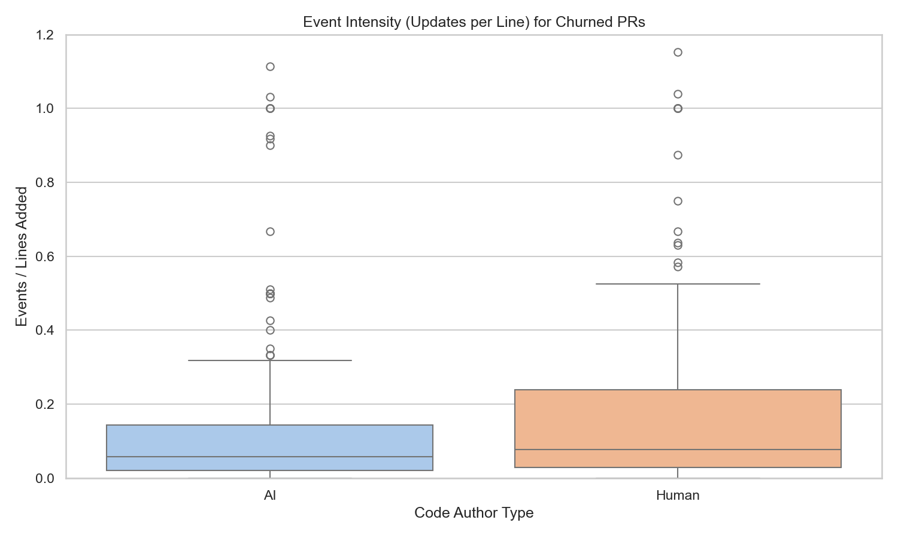
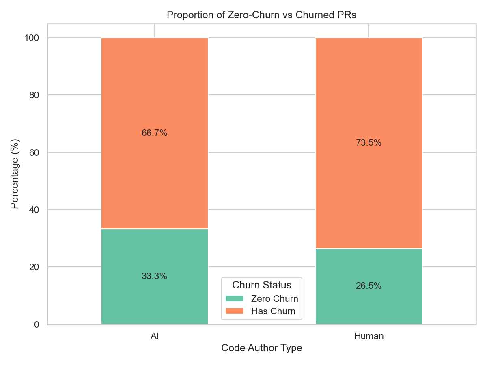
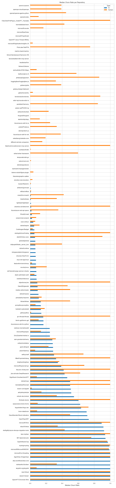
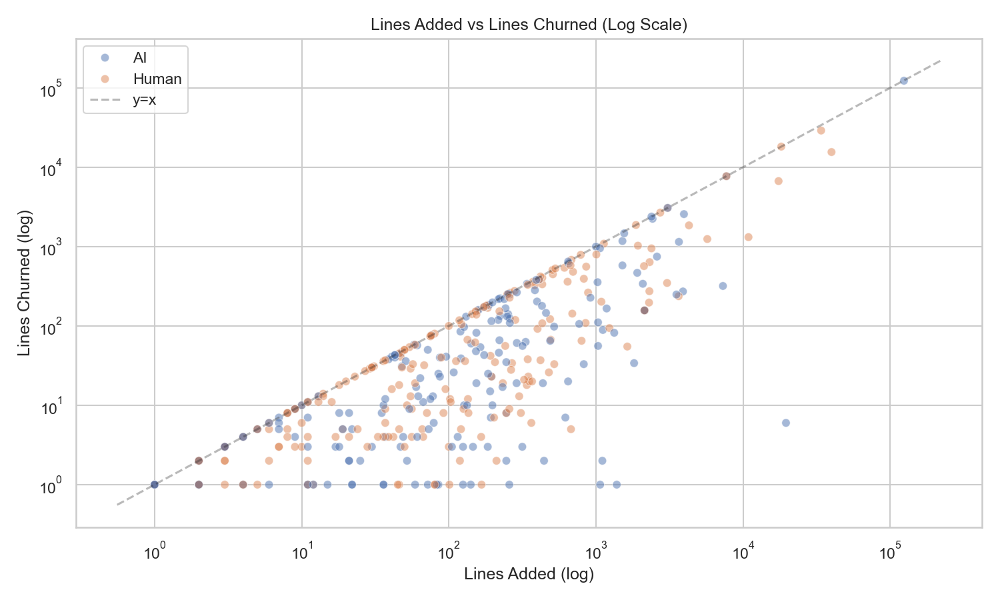
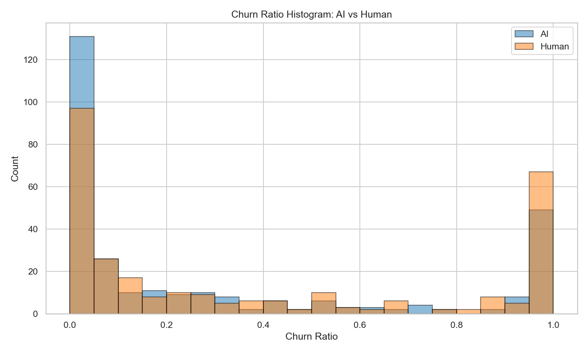

# RQ3: PR-Level Churn Analysis — AI vs Human Code

This directory contains scripts and analysis tools to compare the **stability and maintenance burden** of AI-generated code versus human-written code in pull requests, measured through line churn and change events.

---

## Dataset

| File | Description |
|:---|:---|
| `pr_level_metrics_500st_full.csv` | **Full dataset** — 585 PRs (294 AI, 291 Human) across 126 repositories |
| `plotting_csv/pr_level_metrics.csv` | Baseline sample |
| `plotting_csv/pr_level_metrics_250st.csv` | 250-star threshold sample |
| `plotting_csv/pr_level_metrics_500st.csv` | 500-star threshold sample |

### CSV Schema

| Column | Description |
|:---|:---|
| `repo` | GitHub repository (owner/name) |
| `pr` | Pull request number |
| `type` | `AI` or `Human` |
| `added` | Total lines added in the PR |
| `churned` | Lines subsequently rewritten within 90 days |
| `events` | Number of distinct change events touching those lines within 90 days |
| `ratio` | Churn ratio = `churned / added` |

---

## Key Findings (Full Dataset — 585 PRs, 126 Repos)

### Aggregate Statistics (Line-Level True Churn)

| Metric | AI Code | Human Code |
|:---|:---|:---|
| **Pairs Analyzed** | 294 | 291 |
| **Lines Contributed** | 249,677 | 212,469 |
| **Specific Lines Rewritten** | 160,464 | 110,862 |
| **Avg Churn Ratio** | 29.93% | 38.32% |
| **Total Change Events** | 6,530 | 16,236 |
| **Events Per Line** | 0.0262 | 0.0764 |

### Per-PR Descriptive Statistics

| Metric | AI (Mean) | AI (Median) | Human (Mean) | Human (Median) |
|:---|:---|:---|:---|:---|
| **Churn Ratio** | 0.2993 | 0.0756 | 0.3832 | 0.1855 |
| **Lines Added** | 849.2 | 58.0 | 730.1 | 57.0 |
| **Lines Churned** | 545.8 | 3.0 | 381.0 | 8.0 |
| **Change Events** | 22.2 | 2.0 | 55.8 | 3.0 |
| **Zero-Churn PRs** | 33.3% | — | 26.5% | — |

### Statistical Tests

- **Mann-Whitney U test** (churn ratio): U = 37,449, **p = 0.0081** → statistically significant
- **Cliff's delta**: −0.125 (small effect size; AI code churns *less* than Human code)

### Interpretation

1. **AI code is more stable on average** — lower median churn ratio (0.076 vs 0.186) and a higher proportion of zero-churn PRs (33% vs 27%).
2. **Human code undergoes more frequent maintenance** — higher mean change events (55.8 vs 22.2).
3. **The effect is statistically significant but small** — the p-value (0.008) confirms the difference is not due to chance, but Cliff's delta (−0.125) shows the practical difference is modest.

---

## Plots

All plots for the full dataset are saved in **`plots_500st_full/`**.

### 1. Churn Ratio Distribution (Boxplot)


### 2. Change Events vs Lines Added (Scatter)


### 3. Events Per Line Distribution (KDE)


### 4. Churned Lines vs Added Lines (Regression)


### 5. Churn Ratio Violin Plot (Conditional: churn > 0)


### 6. Event Intensity Boxplot (Conditional: churn > 0)


### 7. Zero-Churn vs Churned PRs (Stacked Bar)


### 8. Per-Repository Median Churn Ratio


### 9. Lines Added vs Lines Churned (Log Scale)


### 10. Churn Ratio Histogram


---

## Project Structure

| File | Description |
|:---|:---|
| `plot_full_analysis.py` | **Main script** — generates all 10 plots + statistics for the full dataset |
| `plot_churn_results.py` | Generates 4 core visualizations (older, uses smaller samples) |
| `analyze_rq3.py` | Conditional churn intensity analysis with report generation |
| `churn_analysis.py` | Core logic for calculating churn metrics from Git history |
| `line_churn_analysis.py` | Detailed line-level churn analysis |
| `analyze_prs.py` | PR processing and metric extraction |

## Setup

1. Ensure Python 3.x is installed.
2. Install dependencies:
   ```bash
   pip install pandas seaborn matplotlib scipy numpy
   ```

## Usage

### Run Full Analysis (Recommended)

```bash
python plot_full_analysis.py
```

This generates all 10 plots in `plots_500st_full/` and prints descriptive statistics with Mann-Whitney U and Cliff's delta.

### Run Conditional Churn Analysis

```bash
python analyze_rq3.py
```

### Run Core Plot Generation (Older Samples)

```bash
python plot_churn_results.py
```
